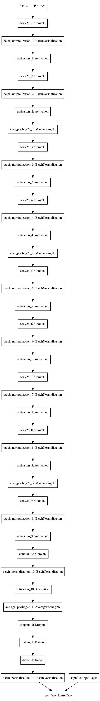
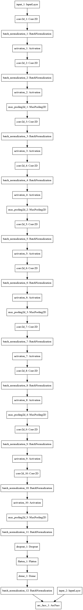
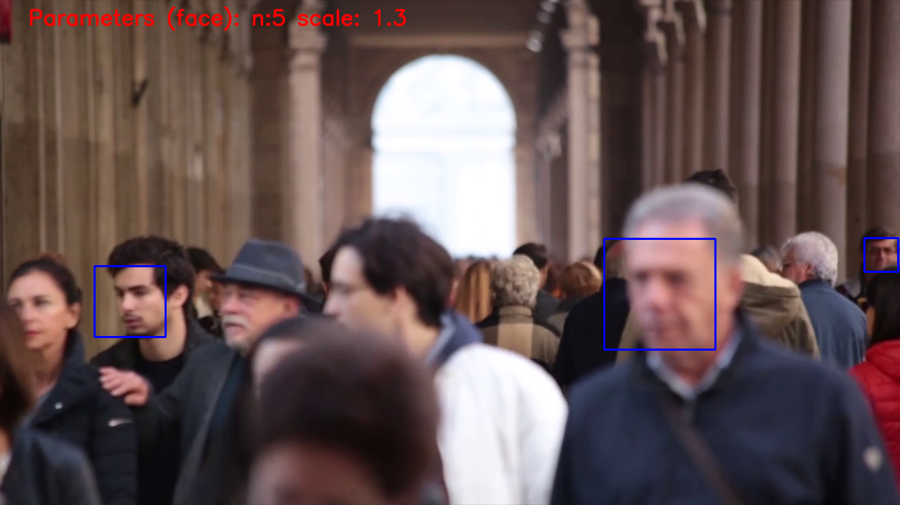
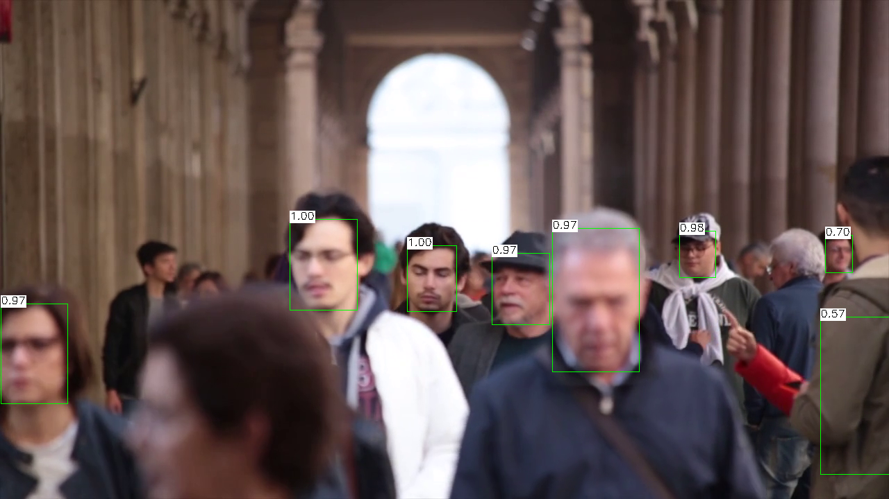
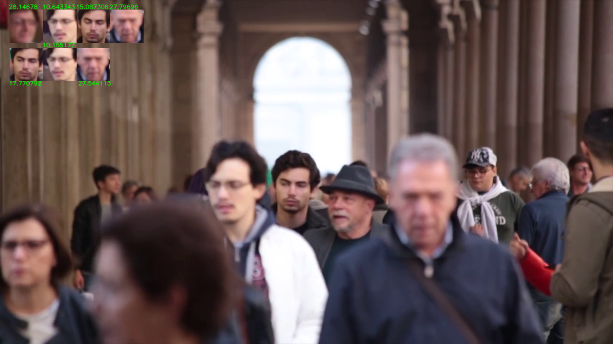
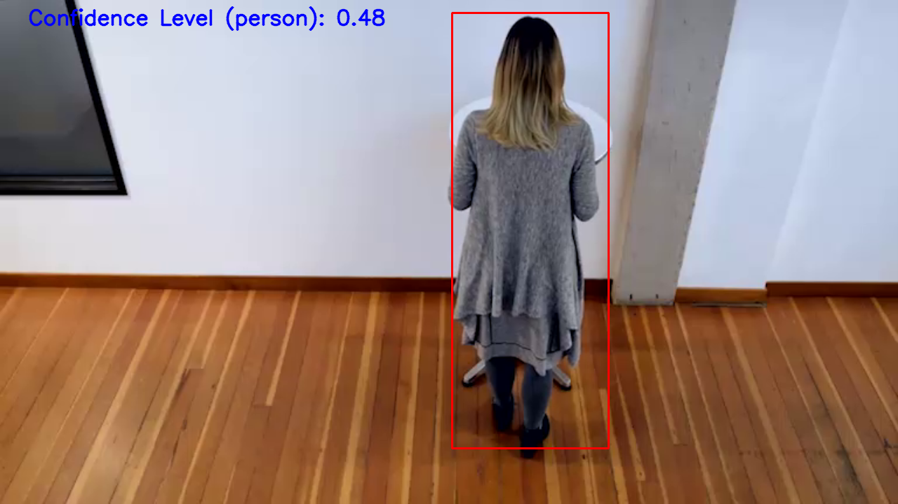
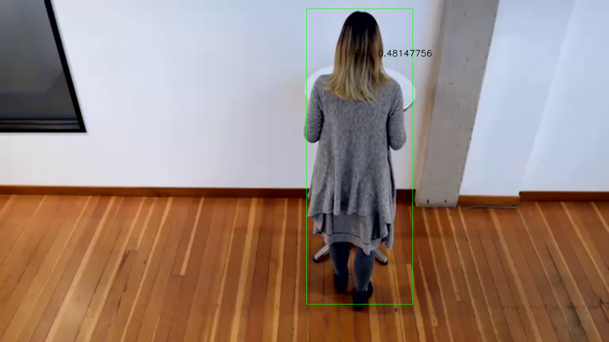
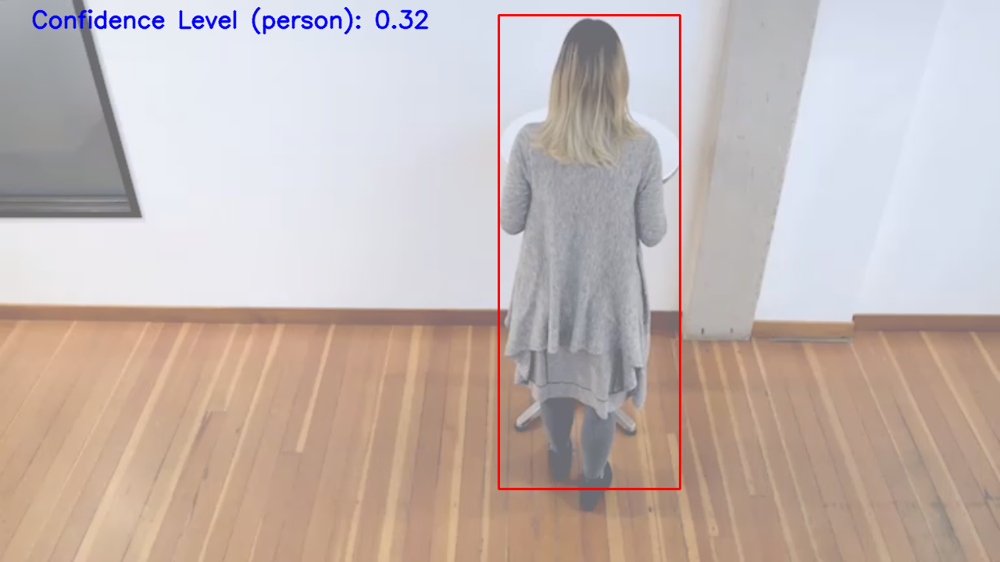
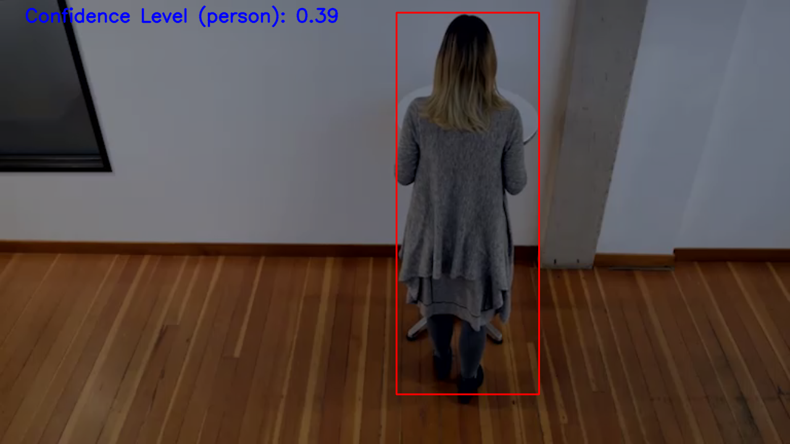

# Project Write-Up

You can use this document as a template for providing your project write-up. However, if you have a different format you prefer, feel free to use it as long as you answer all required questions.

The project components consist of:

- Ice Breaker Section

```

  Which is a Collection of Pascal VOC2007 dataset followed by writing the dataset in `.record` format compatible with `TFRecordDataset` and `TFRecordReader` of tensorflow. Inference time, accuracy are calculated for each data point.

```

- Computer Vision and Use Case

```

  OpenCV tests the accuracy for softmax model and the ssd model.
  OpenCV reports the memory consumption of the model.

```

- Media Processing and Computer Vision

```

  Python inference frame from the people counter app is sent to FFMPEG for processing which is then received by FFSERVER and made available as a websocket to a web based application

  Batch processing is used: 
  (1) based on async inference, 
  
  Batch processing is also used:
  (2) based on batch size of images

```

**Determines the FPS required for the Application**

- Performance statistics conducted on people counter

  Only Batch of Input Images:

  ```bash

  cd student-repositories/nd131-openvino-people-counter-newui/

  python main_file.py -m ./models/person-detector/SqueezeNetSSD-5Class.xml -l /opt/intel/openvino/deployment_tools/inference_engine/lib/intel64/libcpu_extension_sse4.so -d CPU -pt 0.45 --thickness 2 -i Pedestrian_Detect_2_1_1.mp4  --batch_size 64 --mode sync --output_log logs/openvino/main_ssd.log --output_video output_video_sync.avi

  0.016519666915302468
  FPS:  60.53390816697895

  ```

__________________________________________________________________________________

# DIRECTORY STRUCTURE

- apps: 

  - ngrok

  Include ngrok application for demonstration

- certs: 

  - certificate.p12
  - certificate.pem
  - key.pem

  openssl certifications for any website authentication and authorization

- env: 

  - venv
  - bashrc_file
  - requirements.txt

  Initialize the environment

- ffmpeg

  - server.conf

  server config file

- images: Sample images for the README.md

- model-repositories: 

  - SqueezeNetSSD-5Class.prototxt

  Contains repository for an edge optimized SSD model in caffe as well as IR format

- models: 

  - arcface-project
  - motion-tracking
  - object-detector
  - person-detector

  A repository that contains list of models used for people counter app

- resources:

  - Pedestrian_Detect_2_1_1.mp4

- student-repositories: 

  - arcface-project: How the model was trained

  - motion-tracking: Motion Tracking and Optical Flow implementation of the model that can demonstrate the brightness or lightness changes in model accuracy 

  - nd131-openvino-people-counter-newui: ND131 Repository: That contains people counter repository in detail

  - test: 

    - inference.py
    - metrics_face.py
    - object_detection.py
    - score.py
    - test_dnn.py
    - test_dnn_accuracy.py
    - test_videoio_inference.py
    - test_videoio_inference_graph.py
    - tests_common.py

  - webservice: 

    - server: Mosca MQTT Server
    - ui: Websocket UI
  
__________________________________________________________________________________

# HOW TO GENERATE VIDEOS

**How to generate the people counter video**


The command line input is optimised for performance and accepts batch size of upto 64 due to several models being taken into consideration.

```bash

  cd student-repositories/nd131-openvino-people-counter-newui/

  python main_file.py -m ./models/person-detector/SqueezeNetSSD-5Class.xml -l /opt/intel/openvino/deployment_tools/inference_engine/lib/intel64/libcpu_extension_sse4.so -d CPU -pt 0.48 -th 2 -i Pedestrian_Detect_2_1_1.mp4  --batch_size 64 --mode sync --output_log logs/openvino/main_log_ssd.log --output_video output_video_sync_video.avi

```

  **This is for generating the video based on batch_size = 64 such that identification is done within:**

  - Inference Time = 1.8 ms
  - People Count = 1 per frame if person present otherwise 0
  - Person Duration = 0.3522 per batch

__________________________________________________________________________________

# HOW TO EXECUTE

**How to execute the app**

  **This is for generating the video based on batch_size = 1 such that identification is done within:**


  - Inference Time = 18 ms

**Executes the Application under the Dashboard (threads = 1)**

This command line input takes in batch size of 1, and achieves an inference time of 18 ms.

```bash

  python main.py -m "models/person-detector/FP32/SqueezeNetSSD-5Class.xml" -i Pedestrian_Detect_2_1_1.mp4 -th 2 -ct 0.38 --batch_size 1 --threads 1 | ffmpeg -v warning -f rawvideo -pixel_format bgr24 -video_size 768x432 -framerate 24 -i - http://0.0.0.0:3004/fac.ffm

```

  **This is for generating the video based from the workspace:**


_______________________________________________________________________

**Executes the Application under the Dashboard (threads = 2)**

This command line input takes in batch size of 1, and achieves an inference time of 18 ms.

```bash

  python main.py -m "models/person-detector/FP32/SqueezeNetSSD-5Class.xml" -i Pedestrian_Detect_2_1_1.mp4 -th 2 -ct 0.38 --batch_size 1 --threads 2 | ffmpeg -v warning -f rawvideo -pixel_format bgr24 -video_size 768x432 -framerate 24 -i - http://0.0.0.0:3004/fac.ffm

```

  **This is for generating the video based from the workspace (without sharing personal data of the person):**


_____________________________________________________________________________

# CHOICE OF MODELS

## Reason for the models chosen

**Reason:**

```

    Person Detector model is used for bounding box detection when a new person or previous person comes into the frame.

      models/person-detector/SqueezeNetSSD-5Class.xml

    Object Detector is used to demonstrate the heatmap of the model when a new person or a previous person is in the frame.

      models/object-detector/squeezenet_softmax.xml

    Face Detector is used to include the previously counted person in the frame in the statistics based on facial recognition of a person.

      student-repositories/nd131-openvino-people-counter-newui/models/face_recognizer_lognorm_cl/arcface.xml

      student-repositories/nd131-openvino-people-counter-newui/models/face_recognizer_pnorm_cl/arcface.xml


```

_____________________________________________________________________________

# CHECKING LAYERS FOR SUPPORTED / UNSUPPORTED

```bash

  cd student-repositories/nd131-openvino-people-counter-newui/network/
  
  python feed_network.py -m "../../../models/person-detector/SqueezeNetSSD-5Class.xml" -l /opt/intel/openvino/deployment_tools/inference_engine/lib/intel64/libcpu_extension_sse4.so -d CPU --img ../deep_learning_cv/presentation/person/person-detector.png --batch_size 1 --factor 0.01

  (1, 1, 12800, 7)
  IR successfully loaded into Inference Engine.

```

_____________________________________________________________________________

# MODEL SOURCE

  ## WHERE The Model was Obtained from

  **Link (PB):** [https://raw.githubusercontent.com/opencv/opencv_3rdparty/dnn_samples_face_detector_20180220_uint8/opencv_face_detector_uint8.pb](https://raw.githubusercontent.com/opencv/opencv_3rdparty/dnn_samples_face_detector_20180220_uint8/opencv_face_detector_uint8.pb)

  **Link (PBTxt):** [https://raw.githubusercontent.com/opencv/opencv/master/samples/dnn/face_detector/opencv_face_detector.pbtxt](https://raw.githubusercontent.com/opencv/opencv/master/samples/dnn/face_detector/opencv_face_detector.pbtxt)

  ## WHERE The Model was Obtained from

  **Link (Caffe):** [https://github.com/intel/Edge-optimized-models/blob/master/SqueezeNet%205-Class%20detection/SqueezeNetSSD-5Class.caffemodel?raw=true](https://github.com/intel/Edge-optimized-models/blob/master/SqueezeNet%205-Class%20detection/SqueezeNetSSD-5Class.caffemodel?raw=true)

  **Link (ProtoTxt):** [https://raw.githubusercontent.com/intel/Edge-optimized-models/master/SqueezeNet%205-Class%20detection/SqueezeNetSSD-5Class.prototxt](https://raw.githubusercontent.com/intel/Edge-optimized-models/master/SqueezeNet%205-Class%20detection/SqueezeNetSSD-5Class.prototxt)

  ## WHERE The Model was Obtained from
  
  Originating from this source code repository:
  [https://github.com/Intel-OpenVINO-Edge-AI-Scholarship/arcface-project](https://github.com/Intel-OpenVINO-Edge-AI-Scholarship/arcface-project)

  ## WHERE The Model was Obtained from
  
  Originating from this source code repository:
  [https://github.com/intel/Edge-optimized-models](https://github.com/intel/Edge-optimized-models)

  ## WHERE The Model was Obtained from
  
  Originating from this source code repository:
  [https://github.com/caffe2/models](https://github.com/caffe2/models)

  The model is Originating from this repository:
  [https://github.com/Intel-OpenVINO-Edge-AI-Scholarship/model_conversion_formats.git](https://github.com/Intel-OpenVINO-Edge-AI-Scholarship/model_conversion_formats.git)

_____________________________________________________________________________


# MODEL OPTIMIZER 

The Model Optimizer uses these three models as per the problem statement.

## Object Detection

### Preprocessing Stage

  #### Face Detection using OpenCV Face Detector

  **How to download those pre-trained models**

  ## WHERE The Model was Obtained from

  **Link (PB):** [https://raw.githubusercontent.com/opencv/opencv_3rdparty/dnn_samples_face_detector_20180220_uint8/opencv_face_detector_uint8.pb](https://raw.githubusercontent.com/opencv/opencv_3rdparty/dnn_samples_face_detector_20180220_uint8/opencv_face_detector_uint8.pb)

  **Link (PBTxt):** [https://raw.githubusercontent.com/opencv/opencv/master/samples/dnn/face_detector/opencv_face_detector.pbtxt](https://raw.githubusercontent.com/opencv/opencv/master/samples/dnn/face_detector/opencv_face_detector.pbtxt)

  #### Face Detection using OpenCV Viola-Jones

  This is available in Linux and Windows as an XML file and uses OpenCV for detection

_____________________________________________________________________________

### Pipeline Stage

  __Person Detectors use only 1 method as seen in protos:__

  - SQUEEZENET SSD with OpenVINO

  **How to download those pre-trained models**

  ## WHERE The Model was Obtained from

  **Link (Caffe):** [https://github.com/intel/Edge-optimized-models/blob/master/SqueezeNet%205-Class%20detection/SqueezeNetSSD-5Class.caffemodel?raw=true](https://github.com/intel/Edge-optimized-models/blob/master/SqueezeNet%205-Class%20detection/SqueezeNetSSD-5Class.caffemodel?raw=true)

  **Link (ProtoTxt):** [https://raw.githubusercontent.com/intel/Edge-optimized-models/master/SqueezeNet%205-Class%20detection/SqueezeNetSSD-5Class.prototxt](https://raw.githubusercontent.com/intel/Edge-optimized-models/master/SqueezeNet%205-Class%20detection/SqueezeNetSSD-5Class.prototxt)


_____________________________________________________________________________


### Recognition Aspect

  __Face Recognition uses Custom Layers in MYRIAD as well as CPU extension__

  [./student-repositories/nd131-openvino-people-counter-newui/objects/functions/protos/people.proto](./student-repositories/nd131-openvino-people-counter-newui/objects/functions/protos/people.proto)


  Face Recognition is performed when the person is in view within the camera, the custom layers do play an important part in identifying the person and this is where the software which correctly recognizes the person is flexible enough to match the person attributes. This is essential for categorising the risk for conducting the job of correctly recognizing a person.


  - ARCFACE (Trained Model)

  ```proto
    message PeopleDetector {
      optional float confidence_level = 1 [default=0.48];

      enum method {
        SQUEEZENET = 1 [default=1];
        SQUEEZENET_EDGE_OPTIMIZED = 2 [default=2];
      }

      optional string box_color = 2 [default="blue"];
    }
  ```

  The model(s) has been trained using black and white images as well as color images. 

  More details are provided here:
  [./student-repositories/nd131-openvino-people-counter-newui/objects/functions/protos/face.proto](./student-repositories/nd131-openvino-people-counter-newui/objects/functions/protos/face.proto)

  ```proto
    enum method {
      ARCFACE_PREBATCHNORM = 1;
      ARCFACE_AVGPOOL = 2;
    }

    enum custom_layers {
      LOGNORM = 1;
      RISK_RATIO = 2;
    }
  ```

  __PNORM and LOGNORM__

  **The Face recognition task is a trained model by the developer, as per the problem statement. One of the models - `PNORM` is a light-weight model and is trained using color images. The `LOGNORM` model is trained using black and white images.**

  __STOCHASTIC and RISK RATIO__

  **Both the models are used to represent a stochastically determined metric such as an exponential function, and a risk ratio determined metric such as average difference between the ground truth and another observed risk vector of the face.**

_____________________________________________________________________________


### How to convert from DL framework to OpenVINO model

  __Face Recognition Model converted from Keras__

  ## WHERE The Model was Obtained from
  
  Originating from this source code repository:
  [https://github.com/Intel-OpenVINO-Edge-AI-Scholarship/arcface-project](https://github.com/Intel-OpenVINO-Edge-AI-Scholarship/arcface-project)


  ```bash

    git clone https://github.com/Intel-OpenVINO-Edge-AI-Scholarship/arcface-project arcface-project

  ```

  ```bash

    cd arcface-project/

  ```


  __PNORM Model converted to protocol buffer__


```bash

  python keras2pb.py --pb_filename arcface.pb --pb_filename_text arcface.pbtxt --folder models/output_pnorm --arch vgg8_arcface_pnorm --num-features 5

```


  __Architecture of PNORM drawn using keras-visualizer__





  __Architecture of LOGNORM drawn using keras-visualizer__





  __LOGNORM Model converted to protocol buffer__


```bash

  python keras2pb.py --pb_filename arcface.pb --pb_filename_text arcface.pbtxt --folder models/output_lognorm --arch vgg8_arcface_lognorm --num-features 5 --visualize_graph 1

```

_____________________________________________________________________________


### Model Execution Stage

  __Face Detection__

  [./student-repositories/nd131-openvino-people-counter-newui/objects/functions/protos/face.proto](./student-repositories/nd131-openvino-people-counter-newui/objects/functions/protos/face.proto)

  - OPENCV_HAAR (Cascade)

  ```bash

  cd student-repositories/nd131-openvino-people-counter-newui/

  python face_detector.py -m "/usr/share/opencv/haarcascades/haarcascade_frontalface_default.xml" -i deep_learning_cv/presentation/face/face-detector-1.png -t "OpenCV-Haar" -c RED -s 1.3 -th 2 -n 5

  ```

  

  - OPENCV_DNN (Deep Neural Network)

  ```bash

  cd student-repositories/nd131-openvino-people-counter-newui/

  python object_detection.py --framework tensorflow --input deep_learning_cv/presentation/face/face-detector-1-3.png --thr 0.65 --model models/opencv_dnn/opencv_face_detector_uint8.pb --backend 3 --target 0 --config models/opencv_dnn/opencv_face_detector.pbtxt

  ```

  

  Selected Face Detector is the `OpenCV Deep Learning Object Detector model` that is available as a tensorflow model as that is better performing model than `OpenCV_Haar`

  


  __Person Detection__

  ```bash

    cd student-repositories/nd131-openvino-people-counter-newui/

    python app.py -m "Edge-optimized-models/SqueezeNet-5-Class-detection/FP32/SqueezeNetSSD-5Class.xml" -i deep_learning_cv/presentation/person/person-detector.png -d CPU -c RED -ct 0.48 -th 2

  ```

  

  [./student-repositories/nd131-openvino-people-counter-newui/objects/functions/protos/people.proto](./student-repositories/nd131-openvino-people-counter-newui/objects/functions/protos/people.proto)

_____________________________________________________________________________


How to convert to IR Format
---------------------------

### PNORM Model

What I've observed in training this model is it is affecting only 1/2 features by evaluating on different faces. This implies the marginal error between magnitudes of the features can be reduced and that too by reducing the precision of the feature weights. 

**The Model uses Custom layers that are designed using the Model Optimizer only. No CPU extensions are required for this model. The model evaluation metric for extracting the final or almost final layer is an exponential function averaged over decreasing significant digits.**


  ```bash

  /usr/bin/python3.6 /opt/intel/openvino/deployment_tools/model_optimizer/mo_tf.py --data_type "FP32" --tensorflow_object_detection_api_pipeline_config ./models/face_recognizer_pnorm/pipeline.config --tensorflow_use_custom_operations_config ./models/face_recognizer_pnorm/operations.json --input_model ./models/face_recognizer_pnorm/arcface.pb --input_shape "[1,160,160,3]" --input "input_1" --output "batch_normalization_11/cond/Merge" --output_dir ./models/face_recognizer_pnorm_cl/ --extensions ./custom_layers/arcface/cl_pnorm/user_mo_extensions/ --log_level=DEBUG 2>logfile.log

  ```

### LOGNORM Model

The LOGNORM model uses a significance value for the face recognition method. The difference of probability vector is ised to compare against a `zscore` value.

**The Model uses Custom layers that are designed using the Model Optimizer and a CPU extension. The model evaluation function for extracting the final or almost final layer uses a log normal distribution with mean-normalization.**


  ```bash

  /usr/bin/python3.6 /opt/intel/openvino/deployment_tools/model_optimizer/mo_tf.py --data_type "FP32" --tensorflow_object_detection_api_pipeline_config ./models/face_recognizer_lognorm/pipeline.config --tensorflow_use_custom_operations_config ./models/face_recognizer_lognorm/operations.json --input_model ./models/face_recognizer_lognorm/arcface.pb --input_shape "[1,160,160,1]" --input "input_1" --output "dense_1/MatMul" --output_dir ./models/face_recognizer_lognorm_cl/ --extensions ./custom_layers/cl_lognorm/user_mo_extensions/ --log_level=DEBUG 2>loglevel.log

  ```

_____________________________________________________________________________


How to convert to IR Format
---------------------------

  __Person Detector SSD Model converted from CaffeModel__

  The model has been obtained from github which is using a non-intel model, optimized for SSD and Edge.
  
  ## WHERE The Model was Obtained from
  
  Originating from this source code repository:
  [https://github.com/intel/Edge-optimized-models](https://github.com/intel/Edge-optimized-models)

  ```bash
    git clone https://github.com/intel/Edge-optimized-models edge-optimized-models
  ```

  Output files available are:

  - SqueezeNetSSD-5Class.caffemodel
  - SqueezeNetSSD-5Class.prototxt

  ```bash

  /usr/bin/python3.6 /opt/intel/openvino/deployment_tools/model_optimizer/mo_caffe.py --input_proto ./model-repositories/Edge-optimized-models/SqueezeNet-5-Class-detection/SqueezeNetSSD-5Class_64.prototxt --input_model ./model-repositories/Edge-optimized-models/SqueezeNet-5-Class-detection/SqueezeNetSSD-5Class.caffemodel --batch 64 --output_dir ./Edge-optimized-models/SqueezeNet-5-Class-detection/output_custom

  # Move the files
  mv ./Edge-optimized-models/SqueezeNet-5-Class-detection/output_custom/*.* ./models/person-detector/

  ```

  ```bash

  /usr/bin/python3.6 /opt/intel/openvino/deployment_tools/model_optimizer/mo_caffe.py --input_proto ./models/person-detector/SqueezeNetSSD-5Class.prototxt --input_model ./models/person-detector/SqueezeNetSSD-5Class.caffemodel --batch 1 --output_dir ./Edge-optimized-models/SqueezeNet-5-Class-detection/output_custom

  ```

_____________________________________________________________________________


How to convert to IR Format
---------------------------

  __Object Detector Squeeze Net Softmax Model converted from Caffe2__

  The SqueezeNet model uses heatmap of size `1000` to differentiate an image. This model is used in case any objects are to be categorised as a common classification category. 
  
  The evidence for evaluating such a model is presented in:
  
  [./student-repositories/nd131-openvino-people-counter-newui/formats/benchmark_face_recognition_aspect-accuracy-check-voc.md](./student-repositories/nd131-openvino-people-counter-newui/formats/benchmark_face_recognition_aspect-accuracy-check-voc.md)

  Some of the scores obtained are:
  4.99741234e+08, 4.99650699e+08, 4.99770734e+08.

  They do show variability, and the video inference gives values of:
  1000.4341534020593, 1000.5163522355364, 1000.1919143769013

  The model is open for development, and is categorised as a Stand Out task.
  
  Originating from this source code repository:
  [https://github.com/caffe2/models](https://github.com/caffe2/models)

  To download a caffe2 model locally, run:

  ```bash

    python -m caffe2.python.models.download squeezenet

  ```

  The files created are: 

  - init_net.pb
  - predict_net.pb

  Those files are then converted to ONNX format to be converted to the compatible CaffeModel `.caffemodel` for OpenVINO.

  The model is Originating from this repository:
  [https://github.com/Intel-OpenVINO-Edge-AI-Scholarship/model_conversion_formats.git](https://github.com/Intel-OpenVINO-Edge-AI-Scholarship/model_conversion_formats.git)


  ```bash

    git clone https://github.com/Intel-OpenVINO-Edge-AI-Scholarship/model_conversion_formats.git model_conversion_formats

  ```

  ```bash

    cd model_conversion_formats/

  ```

  __Convert the Caffe2 Model to ONNX__

  ```bash

    python caffe2ToONNX.py --predict_net predict_net.pb --init_net init_net.pb --predict_net_name squeezenet --init_net_name squeezenet --onnx_file squeezenet_softmax.onnx

  ```

  Output files created are:

  - squeezenet_softmax.onnx

  __Convert the ONNX Model to prototxt and CaffeModel Version 1__

  ```bash

    python onnx2caffe/convertCaffe.py [onnx_path="squeezenet_softmax.onnx"] [prototxt_path="squeezenet_softmax.prototxt"] [caffemodel_path="squeezenet_softmax.caffemodel"] 

  ```

  Output files created are:

  - squeezenet_softmax.caffemodel
  - squeezenet_softmax.prototxt

  ```bash

  /usr/bin/python3.6 /opt/intel/openvino/deployment_tools/model_optimizer/mo_caffe.py --input_proto squeezenet_softmax.prototxt --input_model squeezenet_softmax.caffemodel --batch 64 --output_dir ./models/softmax

  ```

_____________________________________________________________________________


# EXPLAINING CUSTOM LAYERS

The process behind converting custom layers involves...

### Creating a Custom layer (PNORM)

PNORM is a custom layer where the rounding operation of exponentially activated function applied on the fully connected layer, is approximated to project only 2 features. 

Using brightness, the feature values are compared against the accuracy of the face recognition model.

  __How to generate the extension__

  ```bash

  python /opt/intel/openvino/deployment_tools/tools/extension_generator/extgen.py new --mo-tf-ext --mo-op --ie-cpu-ext --ie-gpu-ext --output_dir=./custom_layers/arcface/cl_pnorm

  ```

  Output files created are:

  - user_ie_extensions
  - user_mo_extensions

How to convert to IR format
---------------------------
  
  __Creating the Custom Layer__

  ```bash

  /usr/bin/python3.6 /opt/intel/openvino/deployment_tools/model_optimizer/mo_tf.py --data_type "FP32" --tensorflow_object_detection_api_pipeline_config ./models/face_recognizer_pnorm/pipeline.config --tensorflow_use_custom_operations_config ./models/face_recognizer_pnorm/operations.json --input_model ./models/face_recognizer_pnorm/arcface.pb --input_shape "[1,160,160,3]" --input "input_1" --output "batch_normalization_11/cond/Merge" --output_dir ./models/face_recognizer_pnorm_cl/ --extensions ./custom_layers/arcface/cl_pnorm/user_mo_extensions/ --log_level=DEBUG 2>logfile.log

  ```

  __Creating the CPU Extension__

  ```bash

  cd /home/aswin/Documents/Courses/Udacity/Intel-Edge-Phase2/Projects/People-Counter-App/Repository/nd131-openvino-people-counter-newui/custom_layers/cl_lognorm/user_ie_extensions/cpu/build

  cmake ..

  make all

  ```

_____________________________________________________________________________


### Creating a Custom layer (LOGNORM)

LOGNORM is a custom layer where the downscaled inputs to fullyconnected layer is transformed using a log normal distribution. 

```bash

  python /opt/intel/openvino/deployment_tools/tools/extension_generator/extgen.py new --mo-tf-ext --mo-op --ie-cpu-ext --ie-gpu-ext --output_dir=./custom_layers/cl_lognorm

```

  Output files created are:

  - user_ie_extensions
  - user_mo_extensions

How to convert to IR format
---------------------------

  __Creating the Custom Layer__

  ```bash

  /usr/bin/python3.6 /opt/intel/openvino/deployment_tools/model_optimizer/mo_tf.py --data_type "FP32" --tensorflow_object_detection_api_pipeline_config ./models/face_recognizer_lognorm/pipeline.config --tensorflow_use_custom_operations_config ./models/face_recognizer_lognorm/operations.json --input_model ./models/face_recognizer_lognorm/arcface.pb --input_shape "[1,160,160,1]" --input "input_1" --output "batch_normalization_11/cond/Merge" --output_dir ./models/face_recognizer_lognorm_cl/ --extensions ./custom_layers/cl_lognorm/user_mo_extensions/ --log_level=DEBUG 2>logfile.log

  ```

  __Creating the CPU Extension__

  ```bash

  cd /home/aswin/Documents/Courses/Udacity/Intel-Edge-Phase2/Projects/People-Counter-App/Repository/nd131-openvino-people-counter-newui/custom_layers/cl_pnorm/user_ie_extensions/cpu/build

  cmake ..

  make all

  ```

_____________________________________________________________________________


**Some of the potential reasons for handling custom layers are...**

- Feeding the network layers with config parameters:

  ```python
  plugin.set_config({})
  ```

- Compatibility with both MYRIAD and CPU devices

  ```python
  plugin.set_config( {'TARGET_FALLBACK': 'HETERO:MYRIAD,CPU'} , device)
  plugin.set_config({"VPU_CUSTOM_LAYERS": 'xml_path'}, device)
  ```

- Improve performance and accuracy of the output layer

  ```python
  in_blob_name = "input_1"
  out_blob_name = "dense_1/MatMul"
  custom_layer_blob_name = "batch_normalization_11/cond/Merge"
  self.network.forward_all(**{in_blob_name: input_blob})[custom_layer_blob_name]
  ```

- In order to retrain the trained model with new layer as the network layer

  ```log
  In Tensorflow, checkpoints are used to re-train the model

  In Caffe2 and Caffe, the network classes can handle the importing of layers and retraining

  In PyTorch, new modules are created in order to extend the current implementation of the network

  In ONNX and Keras, new layers are configured
  ```

_____________________________________________________________________________


# COMPARING MODEL PERFORMANCE

My method(s) to compare models before and after conversion to Intermediate Representations
were...

## DATASETS

I decided to use a common tfrecord[.record] dataset for:

- __Person Detection__

- __Object Detection__

- __Face Recognition__


__Summary of the dataset is as follows:__

  ​	**Validating now..., Records:  2008**

  ​	**Num of people:  5447**


For the dataset I used Pascal **VOC2007** dataset with these details:

  __File that contains Person images to be trained__
  
  [./student-repositories/nd131-openvino-people-counter-newui/formats/person_trainval_cmd.txt](./student-repositories/nd131-openvino-people-counter-newui/formats/person_trainval_cmd.txt) was modified to reflect the pandas format.

  
  __File that stores data and metadata such as bounding boxes and binary images in 1 single tfrecord file__

  
  [./student-repositories/nd131-openvino-people-counter-newui/formats/tfrecord-voc.record](./student-repositories/nd131-openvino-people-counter-newui/formats/tfrecord-voc.record) tfrecord written VOC

  
  ```bash

    git clone https://github.com/Intel-OpenVINO-Edge-AI-Scholarship/tf-object_detection tf-object_detection

  ```

  ```bash

    cd tf-object_detection/

  ```

  Output files created are:

  - tfrecord-voc.record

  
  The annotations are saved in the annotations folder.

  
  __How to create tf record annotations__

  
  ```bash

    python object_detection/dataset_tools/create_pascal_tf_record.py --data_dir=annotations/VOCtrainval_06-Nov-2007/VOCdevkit --year=VOC2007 --output_path=pascal_voc_tfrecord/tfrecord-voc.record --label_map_path annotations/VOCtrainval_06-Nov-2007/VOCdevkit/VOC2007/ImageSets/Main/person_trainval_cmd.txt --annotations_dir Annotations --set trainval

  ```

_____________________________________________________________________________


# ACCURACY AND MODEL PERFORMANCE

  For reporting on accuracy of the models and performance, I decided to use `intelai/models` repository

  ```bash

    git clone https://github.com/Intel-OpenVINO-Edge-AI-Scholarship/intelai-models-benchmarking

  ```

  ```bash

    cd intelai-models-benchmarking/benchmark/

  ```

  Execute the benchmarking app

  ```bash

    python launch_benchmark.py --output-dir=./tensorflow_object_detection_create_coco_tfrecord -mo=inference --data-location=./pascal_voc_tfrecord/tfrecord-voc.record [-rd=0.5] --in-graph=./models/{model_folder}/{model_name}[`.prototxt`,`.hdf5`] --in-weights=./models/{model_folder}/{model_name}[`.caffemodel`] -v --framework=[`caffe`,`keras`] --p=fp32 -m=[`detection_softmax`,`face_recognition_aspect`, `ssd_squeezenet`] -r=./models/{model_folder} --num-inter-threads=1 --num-intra-threads=1 [`--benchmark-only`,`--accuracy-only`] --batch_size=1 --annotations_dir=./annotations/VOCtrainval_06-Nov-2007/VOCdevkit/VOC2007/JPEGImages 2>&1 | tee [`./formats/benchmark_person_detection-voc.log`, `./formats/benchmark_face_recognition_aspect-voc.log`, 
    `./formats/benchmark_object_detection-voc.log`]

  ```

_____________________________________________________________________________


## Without the use of OpenVINO

### Face Recognition Keras ArcFace Model

**The difference between model accuracy pre- and post-conversion was...**


                        FACE RECOGNITION (ARCFACE) PNORM

| ------------------ | ---------------------- | ------------------------- | -------------- |
|      **Test**      | **Pre-Trained Model**  |      **IR Model**         | **Difference** |
| ------------------ | ---------------------- | ------------------------- | -------------- |
| Inference Time     | 0.015306935796031245   |        0.001819           |   0.0134879    |
| Size of Model      |      0.9486 MB         |        0.3805 MB          |     0.5681     |
| Memory / Page File |     808840 bytes       | 444.405 Mb, 50.120 GFlops |  443.6336301   |
| Model Accuracy     |    1967 images, 0.9    |     256 images, 0.7       |      0.2       |


**The difference between model accuracy pre- and post-conversion was...**


                      FACE RECOGNITION (ARCFACE) LOGNORM

| ------------------- | ----------------------| -------------------------- | -------------- |
|      **Test**       | **Pre-Trained Model** |       **IR Model**         | **Difference** |
| ------------------- | ----------------------| -------------------------- | -------------- |
| Inference Time      | 0.021962404251098633  |   0.005555496              |   0.0164069    |
| Size of Model       |      9.9 MB           |   4.8 MB, 50.120 GFlops    |     5.1 MB     |
| Memory / Page File  |     9753960 bytes     | 342.401 Mb, 83.717 GFlops  |   333.0988989  |
| Model Accuracy      |   0.5031695507549447  |     4.799718069103953e-08  |  0.5031695028  |


  __FACE DETECTOR used as a preprocessing model for face recognition__

  This OpenCV tensorflow model is used because it shows high performance when compared to the OpenCV Viola-Jones model.

  __Model Scores__
  
  ```bash

  numactl --cpunodebind=0 --membind=0 python test_videoio_inference_graph.py --input_weights models/output_lognorm/model_sm.hdf5 --batch_size 1 --callback test_lognorm_model --method lognorm --face_detector_weights models/opencv_dnn/opencv_face_detector_uint8.pb --face_detector_model "models/opencv_dnn/opencv_face_detector.pbtxt" --name face_detector

  ```

  __Memory Consumption and Model Size for LOGNORM__

  ```bash

  python test_dnn_accuracy.py test_lognorm_model

  ```

  __Memory Consumption and Model Size for SOFTMAX DETECTION__

  ```bash

  python modules/dnn/misc/python/test/test_dnn_accuracy.py test_perf_detection_softmax_model

  ```

  __CPU Overhead__

  ```bash

  numastat -p /usr/bin/python3.6 logs/keras/numalog.log

  ```

  __Model Stat__

  ```bash

  h5stat -Ss -f ./models/{model_name}/model_sm[`.hdf5`]

  ```

  __Video performance using OpenCV__

  ```bash

  python test_videoio_inference.py --input_graph dnn/layers/squeezenet_softmax_64.prototxt --input_weights dnn/layers/squeezenet_softmax.caffemodel --batch_size 64 --input_file ./Pedestrian_Detect_2_1_1.mp4 --name videoio_caffe --callback test_video 2> logs/keras/network.log

  ```

_____________________________________________________________________________


### Object Detection Model

  __Benchmarking using OpenCV__

  **The difference between model accuracy pre- and post-conversion was...**


                    OBJECT DETECTION (SQUEEZENET SOFTMAX)

|                    |                       |                           |                |
| -------------------| --------------------- | ------------------------- | -------------- |
| **Test**           | **Pre-Trained Model** | **IR Model**              | **Difference** |
| -------------------| --------------------- | ------------------------- | -------------- |
| Inference Time     |     0.03335440531     |     0.007421              |   0.0259337    |
|   Size of Model    |      4.9 MB           |         4.9 MB            |      0.0       |
| Memory / Page File | 34.16 Mb, 0.71 GFlops | 455.162 Mb, 45.224 GFlops |    421.002     |
|   Video Accuracy,  |  0.04092261904761905  |     0.04092261904761905   |       0.0      |
|    Avg Threshold   |                       |                           |                |


  __Performance of SqueezeNet Softmax__
  
  ```bash

  export OPENCV_TEST_DATA_PATH=./modules/dnn/misc/python/test
  ./bin/opencv_perf_dnn --gtest_filter="*SqueezeSoftmaxNetCaffe2*

  ```

  <!---

  __A custom test script on accuracy of DNNs for the softmax model__

  ```bash

  python modules/dnn/misc/python/test/test_dnn_accuracy.py test_detection_softmax_model

  ```

  --->

  In calculating the accuracy, the difference between true prediction probability and noised prediction probability is evaluated.

  Average values obtained on iterating over 10 times and incrementing the pixel value randomly by 0 or 1, using `np.random.randint(0,2,frame.shape),0,255).astype(np.uint8)`

  **Average Values = 0.011554382729999998**

<!---

```log

  ('0.0049307793 not less than 1e-05 : prediction probility in max. 0.0049307793',)
  ('0.008819863 not less than 1e-05 : prediction probility in max. 0.008819863',)
  ('0.012360752 not less than 1e-05 : prediction probility in max. 0.012360752',)
  ('0.004588902 not less than 1e-05 : prediction probility in max. 0.004588902',)
  ('0.009465113 not less than 1e-05 : prediction probility in max. 0.009465113',)
  ('0.015067503 not less than 1e-05 : prediction probility in max. 0.015067503',)
  ('0.019973546 not less than 1e-05 : prediction probility in max. 0.019973546',)
  ('0.012231916 not less than 1e-05 : prediction probility in max. 0.012231916',)
  ('0.009469554 not less than 1e-05 : prediction probility in max. 0.009469554',)
  ('0.018635899 not less than 1e-05 : prediction probility in max. 0.018635899',)

```

--->

  __A custom test script on performance of DNNs for the softmax model__

  ```bash

  python modules/dnn/misc/python/test/test_dnn_accuracy.py test_perf_detection_softmax_model

  ```

  In calculating the memory consumption, the weights are evaluated with the GFlops.

  ```log

  Memory consumption:
    Weights(parameters):  5.713042259216309  Mb
    Blobs:  28.459837913513184  Mb
  Calculation complexity:  0.70646016  GFlops

  ```

  __CPU Overhead__

  ```bash

  numastat -p /usr/bin/python3.6 > logs/softmax/numalog.log

  ```

  __Video performance__

  ```bash

  # tests on caffe module
  /usr/bin/python3.6 -c "import caffe"

  /usr/bin/python3.6 test_videoio_inference.py --input_graph dnn/layers/squeezenet_softmax_64.prototxt --input_weights dnn/layers/squeezenet_softmax.caffemodel --batch_size 64 --input_file ./Pedestrian_Detect_2_1_1.mp4 --name videoio_caffe --callback test_video 2> logs/softmax/network.log

  ```

_____________________________________________________________________________


### Person Detection Model

__Benchmarking using Intel-AI/models__


                PERSON DETECTION (SQUEEZENET EDGE OPTIMIZED)


|                           |                          |               |                |
| ------------------------- | ---------------------    |   ------------------    | -------------- |
| **Test**                  | **Pre-Trained Model**    |   **IR Model**          | **Difference** |
| ------------------------- | ---------------------    |   ------------------    | -------------- |
|    Inference Time         |    0.03105714172         |   0.01559044955         |  0.01546669    |
|    Size of Model          |         12.6 MB          |        12.6 MB          |       0.0      |
|     Memory / Page File    | 65.1905 Mb, 2.213 GFlops | 846.15 Mb,143.49 GFlops |   780.9595     |
|  Video Accuracy, Hit Rate |      0.5474268           |  0.8094421511604672     |   0.26201535   |
|                           |      0.5987507           |  0.8121725413948298     |  0.21342184    |
|                           |      0.63358194          |   0.8747385938962301    |  0.241156654   |
|      Model Accuracy       |   map: 0.03%             |  map: 0.03%             |        0       |
|                           |   recall: 27.06%         |  recall: 27.06%         |        0       |
|                           | detection_accuracy: 3.38%|detection_accuracy: 3.38%|        0       |


  __Bench-marking using OpenCV__

  ```bash

  git clone https://github.com/opencv/opencv opencv-repo
  cd opencv-repo/
  ./opencv_perf_dnn --gtest-filter="*SqueezeNetSSDEdgeOptimized*"

  ```

  __A custom test script on accuracy of DNNs for the SSD model__

  ```bash

  python modules/dnn/misc/python/test/test_dnn_accuracy.py test_ssd_model

  ```

  The accuracy of the SSD model is equated to the Confidence Threshold.

  ```log

  Accuracy / Min. Confidence threshold = 0.48147756

  ```




  __A custom test script on performance of DNNs for the SSD model__

  ```bash

  python modules/dnn/misc/python/test/test_dnn_accuracy.py test_perf_ssd_model

  ```

  ```log

  Memory consumption:
    Weights(parameters):  12.975508689880371  Mb
    Blobs:  52.214980125427246  Mb
  Calculation complexity:  2.212587355  GFlops

  ```

  __CPU Overhead__

  ```bash

  numastat -p /usr/bin/python3.6 > logs/ssd/numalog.log

  ```

  __Video performance__

  ```bash

  numactl --cpunodebind=0 --membind=0 /usr/bin/python3.6 test_videoio_inference.py --input_graph dnn/SqueezeNetSSD-5Class_64.prototxt --input_weights dnn/SqueezeNetSSD-5Class.caffemodel --batch_size 64 --input_file ./Pedestrian_Detect_2_1_1.mp4 --name videoio_caffe --callback test_video 2> logs/ssd/network.log

  ```

_____________________________________________________________________________


## Using OpenVINO

### Face Recognition Keras ArcFace Model

__Benchmarking using Inference Engine API__

__ACCURACY__

```bash
  /usr/bin/python3.6 /opt/intel/openvino/deployment_tools/open_model_zoo/tools/accuracy_checker/setup.py install

  accuracy_check -m config.yml
```

__BENCHMARK__

```bash
  python benchmark_app.py -m models/{model_folder}/{model_name}.xml -d CPU -i datasets/vggface2_test_2/test/n000001/
```

```bash
  python benchmark_app.py -m models/{model_folder}/{model_name}.xml -d MYRIAD -i datasets/vggface2_test_2/test/n000001/
```


                          FACE RECOGNITION (ARCFACE) PNORM

  Model:

  - model_folder = output_pnorm
  - model_name = arcface[.xml]


                          FACE RECOGNITION (ARCFACE) LOGNORM

  Model:

  - model_folder = output_lognorm
  - model_name = arcface[.xml]

    
    
                        OBJECT DETECTION (SQUEEZENET SOFTMAX)
    
  Model:

  - model_folder = person_detect
  - model_name = squeezenet_softmax[.xml]

    
                        PERSON DETECTION (SQUEEZENET EDGE OPTIMIZED)

  Model:

  - model_folder = object_detect
  - model_name = SqueezeNetSSD-5Class[.xml]

_____________________________________________________________________________


**The size of the model pre- and post-conversion was...**

#### Using OpenVINO

```bash

  cd /opt/intel/openvino/

  python deployment_tools/tools/workbench/model_analyzer/model_analyzer.py -m models/{model_folder}/{model_name}.xml -w models/{model_folder}/{model_name}.bin -o report/

```

__PNORM__

```log

  [ INFO ] Loading network files:
          ./models/face_recognizer_pnorm_cl/arcface.xml
          ./models/face_recognizer_pnorm_cl/arcface.bin
  [ INFO ] GFLOPs: 50.120
  [ INFO ] GIOPs: 0.000
  [ INFO ] MParams: 0.095
  [ INFO ] Sparsity: 0.000
  [ INFO ] Minimum memory consumption: 163.840
  [ INFO ] Maximum memory consumption: 444.405

```

__LOGNORM__

```log

  [ INFO ] Loading network files:
          ./models/face_recognizer_lognorm_cl/arcface.xml
          ./models/face_recognizer_lognorm_cl/arcface.bin
  [ INFO ] GFLOPs: 83.717
  [ INFO ] GIOPs: 0.000
  [ INFO ] MParams: 1.211
  [ INFO ] Sparsity: 0.000
  [ INFO ] Minimum memory consumption: 81.920
  [ INFO ] Maximum memory consumption: 342.401

```

__SqueezeNet__

```log

  [ INFO ] GFLOPs: 45.224
  [ INFO ] GIOPs: 0.000
  [ INFO ] MParams: 1.235
  [ INFO ] Sparsity: 0.000
  [ INFO ] Minimum memory consumption: 100.934
  [ INFO ] Maximum memory consumption: 455.162
  [ INFO ] Network status information file name: logs/reports/squeezenet/model_report.csv

```

__SSD Edge Optimized__

```log

  [ INFO ] GFLOPs: 143.487
  [ INFO ] GIOPs: 0.000
  [ INFO ] MParams: 3.139
  [ INFO ] Sparsity: 0.000
  [ INFO ] Minimum memory consumption: 148.685
  [ INFO ] Maximum memory consumption: 846.150
  [ INFO ] Network status information file name: logs/reports/ssd/model_report.csv

```

_____________________________________________________________________________


## Without the use of OpenVINO

# FACE RECOGNITION

The log file that contains the details
[./student-repositories/nd131-openvino-people-counter-newui/formats/benchmark_face_recognition_aspect-voc.md](./student-repositories/nd131-openvino-people-counter-newui/formats/benchmark_face_recognition_aspect-voc.md)

  ```log

  1/1 [==============================] - 0s 17ms/step
  Batchsize: 1
  Time spent per BATCH:    23.1845 ms
  Total samples/sec:    43.1323 samples/s
  Total labeled samples: 1 person

  1/1 [==============================] - 0s 24ms/step
  Batchsize: 1
  Time spent per BATCH:    23.1906 ms
  Total samples/sec:    43.1210 samples/s
  Total labeled samples: 1 person

  1/1 [==============================] - 0s 19ms/step
  Batchsize: 1
  Time spent per BATCH:    23.1916 ms
  Total samples/sec:    43.1191 samples/s
  Total labeled samples: 1 person

  1/1 [==============================] - 0s 17ms/step
  Batchsize: 1
  Time spent per BATCH:    23.1912 ms
  Total samples/sec:    43.1199 samples/s
  Total labeled samples: 1 person

  ```

_____________________________________________________________________________


# [OBJECT / PERSON] DETECTOR [SQUEEZENET SOFTMAX / SQUEEZENET SSD EDGE OPTIMIZED]

The log file that contains the details
[./student-repositories/nd131-openvino-people-counter-newui/formats/benchmark_object_detection-voc.md](./student-repositories/nd131-openvino-people-counter-newui/formats/benchmark_object_detection-voc.md)

  ```log

  (1, 3, 224, 224)
  Batchsize: 1
  Time spent per BATCH:   141.2901 ms
  Total samples/sec:     7.0776 samples/s
  Total labeled samples: 1 person
  (1, 3, 224, 224)
  Batchsize: 1
  Time spent per BATCH:   141.2874 ms
  Total samples/sec:     7.0778 samples/s
  Total labeled samples: 1 person
  (1, 3, 224, 224)
  Batchsize: 1
  Time spent per BATCH:   141.2856 ms
  Total samples/sec:     7.0779 samples/s
  Total labeled samples: 1 person
  (1, 3, 224, 224)
  steps = 999, 0.13873958587646484 sec
  Batchsize: 1
  Time spent per BATCH:   141.2831 ms
  Total samples/sec:     7.0780 samples/s
  Total labeled samples: 1 person

  ```

The log file that contains the details
[./student-repositories/nd131-openvino-people-counter-newui/formats/benchmark_person_detection-voc.md](./student-repositories/nd131-openvino-people-counter-newui/formats/benchmark_person_detection-voc.md)

  ```log

  Batchsize: 1
  Time spent per BATCH:     5.8722 ms
  Total samples/sec:   170.2947 samples/s
  Total labeled samples: 1 person
  Batchsize: 1
  Time spent per BATCH:     5.8749 ms
  Total samples/sec:   170.2161 samples/s
  Total labeled samples: 1 person
  Batchsize: 1
  Time spent per BATCH:     5.8744 ms
  Total samples/sec:   170.2288 samples/s
  Total labeled samples: 1 person
  steps = 999, 0.005470752716064453 sec
  Batchsize: 1
  Time spent per BATCH:     5.8740 ms
  Total samples/sec:   170.2405 samples/s
  Total labeled samples: 1 person

  ```

_____________________________________________________________________________


ACCURACY
--------

__Convert Annotations from Pascal VOC2007__

  ```bash

  python /opt/intel/openvino/deployment_tools/tools/accuracy_checker_tool/convert_annotation.py voc_detection --imageset_file /home/aswin/Documents/Courses/Udacity/Intel-Edge/Repository/caffe2-pose-estimation/annotations/VOCtrainval_06-Nov-2007/VOCdevkit/VOC2007/ImageSets/Main/person_trainval_imgsets_data.txt --annotations_dir /home/aswin/Documents/Courses/Udacity/Intel-Edge/Repository/caffe2-pose-estimation/annotations/VOCtrainval_06-Nov-2007/VOCdevkit/VOC2007/Annotations --images_dir /home/aswin/Documents/Courses/Udacity/Intel-Edge/Repository/caffe2-pose-estimation/annotations/VOCtrainval_06-Nov-2007/VOCdevkit/VOC2007/JPEGImages/ --output_dir ./output

  ```

_____________________________________________________________________________


# FACE RECOGNITION

  ### Without using OpenVINO

  __Accuracy__

  The log file that contains the details
  [./student-repositories/nd131-openvino-people-counter-newui/formats/benchmark_face_recognition_aspect-accuracy-check-voc.md](./student-repositories/nd131-openvino-people-counter-newui/formats/benchmark_face_recognition_aspect-accuracy-check-voc.md)

  
  ## Image Augmentation

                                            IMAGE
                                          ---------

                  FLIPPING THE IMAGE                      ROTATING THE IMAGE
                  ------------------                      ------------------

              Flip the image horizontally               Rotate the image by 8°

  ```yaml

   DetectionBoxes_Precision/mAP': 1.5104485276902977e-07
   DetectionBoxes_Precision/mAP (large)': 4.6072545830664966e-07
   DetectionBoxes_Precision/mAP (medium)': 0.0
   DetectionBoxes_Precision/mAP (small)': 0.0
   DetectionBoxes_Precision/mAP@.50IOU': 1.5104485276902977e-06
   DetectionBoxes_Precision/mAP@.75IOU': 0.0
   DetectionBoxes_Recall/AR@1': 0.0
   DetectionBoxes_Recall/AR@10': 0.0
   DetectionBoxes_Recall/AR@100': 0.00016863406408094435
   DetectionBoxes_Recall/AR@100 (large)': 0.00024213075060532688
   DetectionBoxes_Recall/AR@100 (medium)': 0.0
   DetectionBoxes_Recall/AR@100 (small)': 0.0

  ```

  `comments included`
<!---
  ```log

  32/542 [>.............................] - ETA: 9s
  64/542 [==>...........................] - ETA: 8s
  96/542 [====>.........................] - ETA: 8s
  128/542 [======>.......................] - ETA: 7s
  160/542 [=======>......................] - ETA: 7s
  192/542 [=========>....................] - ETA: 6s
  224/542 [===========>..................] - ETA: 5s
  256/542 [=============>................] - ETA: 5s
  288/542 [==============>...............] - ETA: 4s
  320/542 [================>.............] - ETA: 4s
  352/542 [==================>...........] - ETA: 3s
  384/542 [====================>.........] - ETA: 2s
  416/542 [======================>.......] - ETA: 2s
  448/542 [=======================>......] - ETA: 1s
  480/542 [=========================>....] - ETA: 1s
  512/542 [===========================>..] - ETA: 0s
  542/542 [==============================] - 10s 19ms/step

  32/546 [>.............................] - ETA: 9s
  64/546 [==>...........................] - ETA: 9s
  96/546 [====>.........................] - ETA: 8s
  128/546 [======>.......................] - ETA: 8s
  160/546 [=======>......................] - ETA: 7s
  192/546 [=========>....................] - ETA: 6s
  224/546 [===========>..................] - ETA: 6s
  256/546 [=============>................] - ETA: 5s
  288/546 [==============>...............] - ETA: 5s
  320/546 [================>.............] - ETA: 4s
  352/546 [==================>...........] - ETA: 3s
  384/546 [====================>.........] - ETA: 3s
  416/546 [=====================>........] - ETA: 2s
  448/546 [=======================>......] - ETA: 2s
  480/546 [=========================>....] - ETA: 1s
  512/546 [===========================>..] - ETA: 0s
  544/546 [============================>.] - ETA: 0s
  546/546 [==============================] - 12s 22ms/step
  /home/aswin/.local/lib/python3.6/site-packages/tensorflow/python/data/ops/iterator_ops.py:408: UserWarning: An unusually high number of `Iterator.get_next()` calls was detected. This often indicates that `Iterator.get_next()` is being called inside a training loop, which will cause gradual slowdown and eventual resource exhaustion. If this is the case, restructure your code to call `next_element = iterator.get_next()` once outside the loop, and use `next_element` as the input to some computation that is invoked inside the loop.
    warnings.warn(GET_NEXT_CALL_WARNING_MESSAGE)
  /home/aswin/Documents/Courses/Udacity/Intel-Edge-Phase2/Projects/People-Counter-App/Repository/models/models/object_detection/keras/face_recognition_aspect/inference/score.py:16: RuntimeWarning: divide by zero encountered in true_divide
    diff = np.abs(risk_vector1 - risk_vector2) / risk_vector1
  creating index...
  index created!
  creating index...
  index created!
  Running per image evaluation...
  Evaluate annotation type *bbox*
  DONE (t=4.29s).
  Accumulating evaluation results...
  DONE (t=0.50s).
   Average Precision  (AP) @[ IoU=0.50:0.95 | area=   all | maxDets=100 ] = 0.000
   Average Precision  (AP) @[ IoU=0.50      | area=   all | maxDets=100 ] = 0.000
   Average Precision  (AP) @[ IoU=0.75      | area=   all | maxDets=100 ] = 0.000
   Average Precision  (AP) @[ IoU=0.50:0.95 | area= small | maxDets=100 ] = 0.000
   Average Precision  (AP) @[ IoU=0.50:0.95 | area=medium | maxDets=100 ] = 0.000
   Average Precision  (AP) @[ IoU=0.50:0.95 | area= large | maxDets=100 ] = 0.000
   Average Recall     (AR) @[ IoU=0.50:0.95 | area=   all | maxDets=  1 ] = 0.000
   Average Recall     (AR) @[ IoU=0.50:0.95 | area=   all | maxDets= 10 ] = 0.000
   Average Recall     (AR) @[ IoU=0.50:0.95 | area=   all | maxDets=100 ] = 0.000
   Average Recall     (AR) @[ IoU=0.50:0.95 | area= small | maxDets=100 ] = 0.000
   Average Recall     (AR) @[ IoU=0.50:0.95 | area=medium | maxDets=100 ] = 0.000
   Average Recall     (AR) @[ IoU=0.50:0.95 | area= large | maxDets=100 ] = 0.000
   'DetectionBoxes_Precision/mAP': 1.5104485276902977e-07,
   'DetectionBoxes_Precision/mAP (large)': 4.6072545830664966e-07,
   'DetectionBoxes_Precision/mAP (medium)': 0.0,
   'DetectionBoxes_Precision/mAP (small)': 0.0,
   'DetectionBoxes_Precision/mAP@.50IOU': 1.5104485276902977e-06,
   'DetectionBoxes_Precision/mAP@.75IOU': 0.0,
   'DetectionBoxes_Recall/AR@1': 0.0,
   'DetectionBoxes_Recall/AR@10': 0.0,
   'DetectionBoxes_Recall/AR@100': 0.00016863406408094435,
   'DetectionBoxes_Recall/AR@100 (large)': 0.00024213075060532688,
   'DetectionBoxes_Recall/AR@100 (medium)': 0.0,
   'DetectionBoxes_Recall/AR@100 (small)': 0.0

  ```
-->

  `comments_included`

<!--
  ```log
    2002: {   'boxes': array([[238, 241,  90, 112],
       [238, 241,  90, 112],
       [238, 241,  90, 112],
       ...,
       [103,  57, 119, 158],
       [157, 114, 196, 270],
       [125, 306, 179, 195]]),
              'classes': array([1]),
              'scores': array([0.793893], dtype=float32)},
    2003: {   'boxes': array([[238, 241,  90, 112],
       [238, 241,  90, 112],
       [238, 241,  90, 112],
       ...,
       [103,  57, 119, 158],
       [157, 114, 196, 270],
       [125, 306, 179, 195]]),
              'classes': array([1]),
              'scores': array([0.97498477], dtype=float32)},
    2004: {   'boxes': array([[238, 241,  90, 112],
       [238, 241,  90, 112],
       [238, 241,  90, 112],
       ...,
       [103,  57, 119, 158],
       [157, 114, 196, 270],
       [125, 306, 179, 195]]),
              'classes': array([1]),
              'scores': array([0.97498477], dtype=float32)},
    2005: {   'boxes': array([[238, 241,  90, 112],
       [238, 241,  90, 112],
       [238, 241,  90, 112],
       ...,
       [103,  57, 119, 158],
       [157, 114, 196, 270],
       [125, 306, 179, 195]]),
              'classes': array([1]),
              'scores': array([0.994861], dtype=float32)},
    2006: {   'boxes': array([[238, 241,  90, 112],
       [238, 241,  90, 112],
       [238, 241,  90, 112],
       ...,
       [125, 306, 179, 195],
       [261, 103,  95, 125],
       [124,  44,  93, 112]]),
              'classes': array([1]),
              'scores': array([0.9248928], dtype=float32)},
    2007: {   'boxes': array([[238, 241,  90, 112],
       [238, 241,  90, 112],
       [238, 241,  90, 112],
       ...,
       [124,  44,  93, 112],
       [261, 103,  95, 125],
       [124,  44,  93, 112]]),
              'classes': array([1]),
              'scores': array([0.8621292], dtype=float32)
  ```
-->

  ## Accuracy Score

  Using risk vector difference = `0.05`, the error is calculated using the difference between augmented face and the original face from the dataset. The risk vector difference is derived from an empirical value. 

  The risk vectors are loaded from a database and there will not be any observable difference in the performance while switch off or switch on of camera feed. 

_____________________________________________________________________________


# PERSON DETECTION

  __Accuracy__

  Person Detection uses SSD bounding boxes and they are evaluated against COCO evaluator from `pycocotools`.

  The log file that contains the details
  [./student-repositories/nd131-openvino-people-counter-newui/formats/benchmark_ssd_squeezenet-accuracy-check-voc.md](./student-repositories/nd131-openvino-people-counter-newui/formats/benchmark_ssd_squeezenet-accuracy-check-voc.md)

  ```yaml

    DetectionBoxes_Precision/mAP: 0.0
    DetectionBoxes_Precision/mAP (large): 0.0
    DetectionBoxes_Precision/mAP (medium): 0.0
    DetectionBoxes_Precision/mAP (small): 0.0
    DetectionBoxes_Precision/mAP@.50IOU: 0.0
    DetectionBoxes_Precision/mAP@.75IOU: 0.0
    DetectionBoxes_Recall/AR@1: 0.0
    DetectionBoxes_Recall/AR@10: 0.0
    DetectionBoxes_Recall/AR@100: 0.0
    DetectionBoxes_Recall/AR@100 (large): 0.0
    DetectionBoxes_Recall/AR@100 (medium): 0.0
    DetectionBoxes_Recall/AR@100 (small): 0.0

  ```

  `comments included`
<!--
  ```log

    Average Precision  (AP) @[ IoU=0.50:0.95 | area=   all | maxDets=100 ] = 0.000
    Average Precision  (AP) @[ IoU=0.50      | area=   all | maxDets=100 ] = 0.000
    Average Precision  (AP) @[ IoU=0.75      | area=   all | maxDets=100 ] = 0.000
    Average Precision  (AP) @[ IoU=0.50:0.95 | area= small | maxDets=100 ] = 0.000
    Average Precision  (AP) @[ IoU=0.50:0.95 | area=medium | maxDets=100 ] = 0.000
    Average Precision  (AP) @[ IoU=0.50:0.95 | area= large | maxDets=100 ] = 0.000
    Average Recall     (AR) @[ IoU=0.50:0.95 | area=   all | maxDets=  1 ] = 0.000
    Average Recall     (AR) @[ IoU=0.50:0.95 | area=   all | maxDets= 10 ] = 0.000
    Average Recall     (AR) @[ IoU=0.50:0.95 | area=   all | maxDets=100 ] = 0.000
    Average Recall     (AR) @[ IoU=0.50:0.95 | area= small | maxDets=100 ] = 0.000
    Average Recall     (AR) @[ IoU=0.50:0.95 | area=medium | maxDets=100 ] = 0.000
    Average Recall     (AR) @[ IoU=0.50:0.95 | area= large | maxDets=100 ] = 0.000
    {   'DetectionBoxes_Precision/mAP': 0.0,
        'DetectionBoxes_Precision/mAP (large)': 0.0,
        'DetectionBoxes_Precision/mAP (medium)': 0.0,
        'DetectionBoxes_Precision/mAP (small)': 0.0,
        'DetectionBoxes_Precision/mAP@.50IOU': 0.0,
        'DetectionBoxes_Precision/mAP@.75IOU': 0.0,
        'DetectionBoxes_Recall/AR@1': 0.0,
        'DetectionBoxes_Recall/AR@10': 0.0,
        'DetectionBoxes_Recall/AR@100': 0.0,
        'DetectionBoxes_Recall/AR@100 (large)': 0.0,
        'DetectionBoxes_Recall/AR@100 (medium)': 0.0,
        'DetectionBoxes_Recall/AR@100 (small)': 0.0}

  ```
-->

  `comments included`
<!--
  ```log
              'scores': array([0.7876617], dtype=float32)},
    1992: {   'boxes': array([[  9,   0, 215,   2]]),
              'classes': array([1]),
              'scores': array([0.66151345], dtype=float32)},
    1996: {   'boxes': array([[38,  0, 48,  0]]),
              'classes': array([1]),
              'scores': array([0.5486111], dtype=float32)},
    1997: {   'boxes': array([[38,  0, 48,  0]]),
              'classes': array([1]),
              'scores': array([0.5486111], dtype=float32)},
    1998: {   'boxes': array([[38,  0, 48,  0]]),
              'classes': array([1]),
              'scores': array([0.5486111], dtype=float32)}}
  ```
-->

_____________________________________________________________________________


# OBJECT DETECTION

  __Accuracy__

  The bounding boxes between ground truth and the detection are kept the same. Each bounding box tagged from the ground truth are mapped to the object detector. 

  The log file that contains the details
  [./student-repositories/nd131-openvino-people-counter-newui/formats/benchmark_detection_softmax-accuracy-check-voc.md](./student-repositories/nd131-openvino-people-counter-newui/formats/benchmark_detection_softmax-accuracy-check-voc.md)
  
  ```yaml

    DetectionBoxes_Precision/mAP: 1.0
    DetectionBoxes_Precision/mAP (large): 1.0
    DetectionBoxes_Precision/mAP (medium): 1.0
    DetectionBoxes_Precision/mAP (small): 1.0
    DetectionBoxes_Precision/mAP@.50IOU: 1.0
    DetectionBoxes_Precision/mAP@.75IOU: 1.0
    DetectionBoxes_Recall/AR@1': 1.0
    DetectionBoxes_Recall/AR@10': 1.0
    DetectionBoxes_Recall/AR@100': 1.0
    DetectionBoxes_Recall/AR@100 (large): 1.0
    DetectionBoxes_Recall/AR@100 (medium): 1.0
    DetectionBoxes_Recall/AR@100 (small): 1.0

    DetectionBoxes_Precision/mAP: 1.0
    DetectionBoxes_Precision/mAP (large): 1.0
    DetectionBoxes_Precision/mAP (medium): 1.0
    DetectionBoxes_Precision/mAP (small): 1.0
    DetectionBoxes_Precision/mAP@.50IOU: 1.0
    DetectionBoxes_Precision/mAP@.75IOU: 1.0
    DetectionBoxes_Recall/AR@1: 1.0
    DetectionBoxes_Recall/AR@10: 1.0
    DetectionBoxes_Recall/AR@100: 1.0
    DetectionBoxes_Recall/AR@100 (large): 1.0
    DetectionBoxes_Recall/AR@100 (medium): 1.0
    DetectionBoxes_Recall/AR@100 (small): 1.0

  ```

  `comments included`
<!--
  ```log

  Average Precision  (AP) @[ IoU=0.50:0.95 | area=   all | maxDets=100 ] = 1.000
  Average Precision  (AP) @[ IoU=0.50      | area=   all | maxDets=100 ] = 1.000
  Average Precision  (AP) @[ IoU=0.75      | area=   all | maxDets=100 ] = 1.000
  Average Precision  (AP) @[ IoU=0.50:0.95 | area= small | maxDets=100 ] = 1.000
  Average Precision  (AP) @[ IoU=0.50:0.95 | area=medium | maxDets=100 ] = 1.000
  Average Precision  (AP) @[ IoU=0.50:0.95 | area= large | maxDets=100 ] = 1.000
  Average Recall     (AR) @[ IoU=0.50:0.95 | area=   all | maxDets=  1 ] = 1.000
  Average Recall     (AR) @[ IoU=0.50:0.95 | area=   all | maxDets= 10 ] = 1.000
  Average Recall     (AR) @[ IoU=0.50:0.95 | area=   all | maxDets=100 ] = 1.000
  Average Recall     (AR) @[ IoU=0.50:0.95 | area= small | maxDets=100 ] = 1.000
  Average Recall     (AR) @[ IoU=0.50:0.95 | area=medium | maxDets=100 ] = 1.000
  Average Recall     (AR) @[ IoU=0.50:0.95 | area= large | maxDets=100 ] = 1.000
  {   'DetectionBoxes_Precision/mAP': 1.0,
      'DetectionBoxes_Precision/mAP (large)': 1.0,
      'DetectionBoxes_Precision/mAP (medium)': 1.0,
      'DetectionBoxes_Precision/mAP (small)': 1.0,
      'DetectionBoxes_Precision/mAP@.50IOU': 1.0,
      'DetectionBoxes_Precision/mAP@.75IOU': 1.0,
      'DetectionBoxes_Recall/AR@1': 1.0,
      'DetectionBoxes_Recall/AR@10': 1.0,
      'DetectionBoxes_Recall/AR@100': 1.0,
      'DetectionBoxes_Recall/AR@100 (large)': 1.0,
      'DetectionBoxes_Recall/AR@100 (medium)': 1.0,
      'DetectionBoxes_Recall/AR@100 (small)': 1.0}
  {   'DetectionBoxes_Precision/mAP': 1.0,
      'DetectionBoxes_Precision/mAP (large)': 1.0,
      'DetectionBoxes_Precision/mAP (medium)': 1.0,
      'DetectionBoxes_Precision/mAP (small)': 1.0,
      'DetectionBoxes_Precision/mAP@.50IOU': 1.0,
      'DetectionBoxes_Precision/mAP@.75IOU': 1.0,
      'DetectionBoxes_Recall/AR@1': 1.0,
      'DetectionBoxes_Recall/AR@10': 1.0,
      'DetectionBoxes_Recall/AR@100': 1.0,
      'DetectionBoxes_Recall/AR@100 (large)': 1.0,
      'DetectionBoxes_Recall/AR@100 (medium)': 1.0,
      'DetectionBoxes_Recall/AR@100 (small)': 1.0}

  ```
-->

  `comments included`
<!--

```log
    2002: {   'boxes': array([[258, 476, 309, 500]]),
              'classes': array([1]),
              'scores': array([4.99700535e+08])},
    2003: {   'boxes': array([[ 88, 237, 326, 490]]),
              'classes': array([1]),
              'scores': array([4.99929916e+08])},
    2004: {   'boxes': array([[  1,   1, 257, 157]]),
              'classes': array([1]),
              'scores': array([4.99588097e+08])},
    2005: {   'boxes': array([[120, 184, 192, 235]]),
              'classes': array([1]),
              'scores': array([4.99703691e+08])},
    2006: {   'boxes': array([[  2,   2, 333, 267]]),
              'classes': array([1]),
              'scores': array([4.99784633e+08])},
    2007: {   'boxes': array([[ 79, 233, 333, 496]]),
              'classes': array([1]),
              'scores': array([4.99630389e+08])}}
```

-->

  ```bash

  python modules/dnn/misc/python/test/test_videoio_inference_graph.py -m models/{model_folder}/{model_name}[`.caffemodel`, `.hdf5`] -mo "inference" --framework ["caffe", "keras"]

  ```

_____________________________________________________________________________


# ASSESS MODEL USE CASES

Some of the potential use cases of the people counter app are...

  • Case 1. To count the No. of people on a shop floor using facial recognition and object detection

  • Case 2. To count the No. of hours spent using facial recognition and face detection

  • Case 3. For monitoring Distant CCTV cameras with or without camera feed using a dashboard and statistics generated by the video

  • Case 4. A movable autonomous truck which checks for the driver's license in the first capture and records who have operated the truck within a certain duration

  • Case 5. A research problem where retention of people in various locations of the floor or land area need to be visualized, that includes the application of optical flow and signal modelling

Each of these use cases would be useful because...

  • Case 1. When the person reappears in the video, the facial recognition hypothesis tests are run to figure out whether it is the same person. The entire frame is sent to the model processing app and each face detected is recognized by the app.

  More details are provided here:
  [./student-repositories/nd131-openvino-people-counter-newui/objects/functions/protos/face.proto](./student-repositories/nd131-openvino-people-counter-newui/objects/functions/protos/face.proto)

  - FaceDetector

  - FaceDetectionEnhancer

  - FaceRecognizer

  The Face Recognizer uses a statistical significance method to reduce the error between an existing feature vector and a new feature vector. If the error is least, it establishes that the person has been matched.

  - FaceDetectionEnhancer

  The Face Detection Enhancer uses a risk difference or odds ratio or a risk ratio to measure the tolerance value between recorded feature vector and a new feature vector. If the confidence interval is high, the error calculator establishes that the person has been matched.

  • Case 2. Once the hypothesis tests come out as true, each face detected are mapped against timer objects between their entry interval and exit interval within a frame. The MQTT Server receives the time spent for each person mapped. The person_id allocated to the detector is a hash of the feature vector recorded.

  More details are provided here:
  [./student-repositories/nd131-openvino-people-counter-newui/objects/functions/protos/counter.proto](./student-repositories/nd131-openvino-people-counter-newui/objects/functions/protos/counter.proto)

  - People

```proto
  message Dimensions {
    optional float stationary = 0.0;
    optional float alternate = 0.0;
    optional float large = 0.0;
    optional float weight1 = 0.0;
    optional float weight2 = 0.0;
  }
```

  There are 5 features in the feature vector which is used for facial recognition. 

  • Case 3. For monitoring Distant CCTV cameras with or without camera feed using a dashboard and statistics generated by the video

  The app contains stat box(es) which represent the time the person retains in the video. The inference time is sent to the MQTT server on every push. The switching on and swithcing off of camera feed improves the performance of the app. 

  The Face detector softmax model in `.pb` format is converted into caffe model for compatibility with OpenVINO toolkit. 

  The Face recognizer model in `.hdf5` format trained in Keras is converted to .pb format in TensorFlow with additional `pipeline.config` and `operations.json` written for conversion to Intermediate Representation (IR) model of OpenVINO.

  The People detector model in `.caffemodel` and `.prototxt` is taken because the network layers are seen in a text-based format. 

  The selection of models depend on performance of the app. OpenVINO can do async inference requests which provides regulation in batch size of the input to the Inference Engine. The Distant CCTV cameras may not require the exact camera feed, and so another use case of Motion Tracking has been provided in this example for further exploration. 

  The motion Tracking model uses Optical Flow of the frame and deliver the output in terms of an amplitude that is independent on the brightness or lighting of the frame. The motion tracking model is written in `.onnx` which is converted from `Pytorch` deep learning framework. 

  • Case 4. A movable autonomous truck which checks for the driver's license in the first capture and records who have operated the truck within a certain duration

  The autonomous truck requires regulation of entry to operate and the recordings of time to be submitted on a daily basis to a server. The data is sent through a lean network and hence MQTT is chosen as the Application Layer. The driver's face hash is checked against the driver's license data vector stored in `.npy` format. Using the camera feed to the app, the motion is detected and the timer object for that person is triggered for a specific interval. 

  The `.hdf5` face hash model converted into IR model and the motion tracking model in `.onnx` converted into OpenVINO model are used for face recognition and motion detection respectively. 

  • Case 5. A research problem where retention of people in various locations of the floor or land area need to be visualized, that includes the application of optical flow and signal modelling

  In the cases where there is a need to integrate the signal data into an image, the optical flow model can provide a visualization of the scene from the image. Such a use case is seen within shop floor, supermarkets, airports, large buildings and open spaces where there is a need to determine the movement of people, visits to the shops, usages of the landmarks in an area to maximise financial outcomes, and improve standards of delivery. 

  The models proposed here are:

  (1) the Optical Flow model in `.ONNX` that takes in input image, input data, and detection boxes to produce a visualization

  (2) the people characteristics model that records the gender and predicted age from input frame. This one uses intel model on `age-gender-recognition-retail-0013`. 

_____________________________________________________________________________


# ASSESS EFFECTS ON END USER NEEDS

Lighting, model accuracy, and camera focal length/image size have different effects on a
deployed edge model. The potential effects of each of these are as follows...

  __Lighting__

  The lighting and or brightness affects the model accuracy in many ways. The decrease or increase in lighting falls back the confidence interval in prediction which reduces the rate of detection of people as well as count of people monitoried in a camera feed.

  The amplitude part of the optical flow image stays constant with constant rate of camera shutter open/close and almost negligible relative motion. There are no face detection results conducted on an image with characteristic brightness or lighting nullified using optical flow. Unless a training is conducted on those images with characteristic brightness nullified, the detection cannot be performed.

  #### On Models

  Let's represent the image in terms of floating points, on decreasing the brightness, the ratio turns out to be:

  ```mathematica

  (P1 - 10x)  
  ------------
  (Pmax - 10x) 

  ```

  where x is a positive factor. This is a relevance ratio to the model's activation of neurons. Otherwise termed as a DEA (Data Envelopment Analysis) model as the ratio of weighted sums with lesser statistical efficiency. If you derive the change in numerator vs change in denominator, 

  ```mathematica

  Δw
  ---
  Δx 

  ```

  it will be:

  negatively dependent on Pmax with the factor: 

  ```mathematica

  -1 * Pmax * ( x1 )
             -------
              ( x )

  ```

  As the ratio increases due to increase in lighting, the confidence level in prediction decreases drastically because the neural network shows a disparity in prediction as the variable Pmax (which is our denominator) is higher for large brightness. 

  The images shown below confirms it.

  

  

  __Model Accuracy__

  The accuracy of the model affects the statistical significance, confidence interval in detection of people.

_____________________________________________________________________________


#### On Models

  The decrease of accuracy affects the count of people detected within a frame. This decrease of accuracy may be due to fusing of layers or quantisation. When the precision of the model is reduced, the accuracy slightly changes. The fusing of two layers is equivalent to applying an eltwise operation and shift operation. This improves the model performance by a large margin but the accuracy is reduced. The freezing of the layers disconnects the node from the graph and specifies the shape to be a constant rather than infering the shape from the input image. This thereby increases the performance as well as increases the accuracy because of its closenes to the ground truth predictions. 

  The Mean Average Precision (mAP) is a metric that is represented as the ratio of overlap vs union of two SSD boxes or confidence intervals. This is highly relevant to how the models behave when the accuracy is varied. 

## Model Research

[This heading is only required if a suitable model was not found after trying out at least three
different models. However, you may also use this heading to detail how you converted 
a successful model.]

**I got all non intel models and was able to successfully convert all to OpenVINO models**
